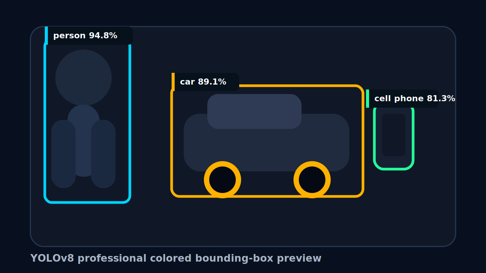
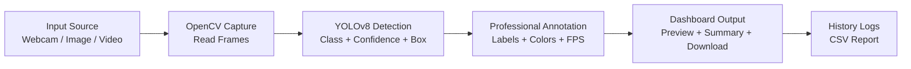

# 🚀 Real-Time Object Detection System using YOLOv8


An attractive, colorful, professional AI dashboard that detects real-time objects from webcam, uploaded images, and video files using **YOLOv8 + OpenCV + Flask**.

## ✨ Project Preview

### 🖥️ Modern Dashboard UI

<!-- Uploading "Screenshot 2026-05-05 093659.png"... -->

### 🎯 Sample Detection Output



### 🎬 Demo Video

<video src="assets/demo/how-it-works.mp4" controls width="100%"></video>

> If the video preview does not load on GitHub, open `assets/demo/how-it-works.mp4` directly after cloning the repository.

## 🔥 Key Features

- 🎥 Real-time webcam object detection
- 🖼️ Image upload and object detection
- 📹 Video upload and frame-by-frame detection
- 🎯 YOLOv8 model inference with confidence score
- 🌈 Colorful professional bounding boxes
- 🧠 Better default accuracy using `yolov8s.pt`
- ⚡ Fast, Balanced, and High Accuracy modes
- 📊 Detection summary panel with object counts
- 🧾 CSV detection history logs
- 📸 Screenshot capture from live webcam
- 🔊 Voice alerts for `person`, `car`, and `cell phone`
- ⬇️ Download detected image/video output
- 🧩 Custom YOLO `.pt` model upload support
- 🖥️ Full screen dashboard mode
- 🛡️ Error handling for camera and invalid uploads

## 🧠 How It Works



## 🏗️ Tech Stack

| Layer | Technology |
|---|---|
| AI Model | YOLOv8 Ultralytics |
| Computer Vision | OpenCV |
| Backend | Python, Flask |
| Frontend | HTML, CSS, JavaScript |
| Data / Reports | NumPy, Pandas, CSV |

## 📁 Folder Structure

```text
Real-Time-Object-Detection-yolov8/
├── app.py
├── run_server.py
├── requirements.txt
├── README.md
├── assets/
│   └── demo/
│       ├── dashboard-preview.svg
│       ├── detection-preview.svg
│       └── how-it-works.mp4
├── models/
│   └── README.md
├── static/
│   ├── css/styles.css
│   ├── js/app.js
│   ├── uploads/
│   ├── outputs/
│   └── screenshots/
├── templates/
│   └── index.html
└── logs/
    └── detection_history.csv
```

## ⚙️ Installation

Use Python `3.10`, `3.11`, or `3.12` for the smoothest YOLOv8/PyTorch setup.

```bash
git clone https://github.com/ranjithkumar077/Real-Time-Object-Detection-yolov8.git
cd Real-Time-Object-Detection-yolov8
python -m venv .venv
.venv\Scripts\activate
pip install -r requirements.txt
```

## ▶️ Run The App

```bash
python run_server.py
```

Open:

```text
http://127.0.0.1:5000
```

## 🕹️ How To Use

1. Choose detection quality: `Fast Preview`, `Balanced Accuracy`, or `High Accuracy`.
2. Select model: `YOLOv8s Better`, `YOLOv8m Strong`, or `YOLOv8n Fast`.
3. Keep confidence around `20% - 30%` for better object recall.
4. Open `Live Webcam` and click `Start`.
5. Upload images in `Image Detect`.
6. Upload videos in `Video Detect`.
7. Download detected results and export logs.

## 🎯 Best Accuracy Settings

| Goal | Recommended Setting |
|---|---|
| Best balance | YOLOv8s + Balanced Accuracy |
| Highest accuracy | YOLOv8m + High Accuracy |
| Fastest preview | YOLOv8n + Fast Preview |

## 🧪 Example Use Cases

- Smart surveillance dashboard
- Traffic object monitoring
- Classroom AI computer vision project
- Retail object analytics prototype
- Interview-ready AI portfolio project

## 💼 Resume Description

Developed an advanced real-time Object Detection System using YOLOv8, OpenCV, Flask, and Python capable of detecting multiple objects from webcam, images, and videos with high accuracy, live inference, confidence scoring, FPS tracking, automated result saving, custom model support, screenshot capture, voice alerts, and CSV-based detection history reporting through a modern responsive dashboard UI.

## 🗣️ Interview Explanation

This project detects objects from webcam, image, and video sources using YOLOv8. OpenCV reads frames, YOLOv8 predicts object class, confidence, and bounding-box coordinates, and the Flask backend returns annotated results to a colorful dashboard. The system includes real-time streaming, downloadable outputs, custom model support, voice alerts, FPS tracking, and detection history logs.

## 🚀 Future Enhancements

- Add object tracking with DeepSORT or ByteTrack
- Add heatmaps and analytics charts
- Add RTSP/IP camera support
- Add database storage with SQLite or PostgreSQL
- Add Docker deployment
- Add role-based login system
- Add email/SMS alerts for selected objects

## 🛠️ Troubleshooting

- If webcam does not start, try camera index `1`.
- If the first run is slow, wait for YOLOv8 model download.
- If detection misses objects, use `YOLOv8m Strong` and `High Accuracy`.
- If video preview does not play in browser, download the processed video.

## ⭐ Author

**Ranjith Kumar**  
GitHub: [ranjithkumar077](https://github.com/ranjithkumar077)
#
